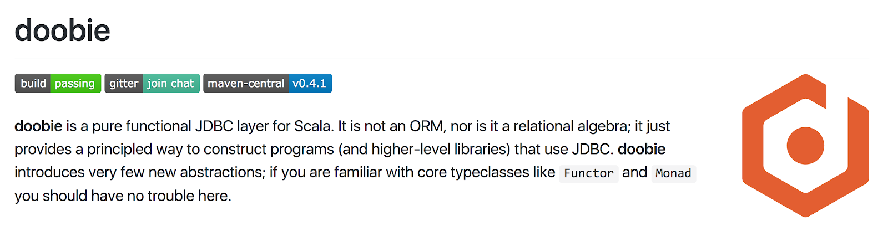
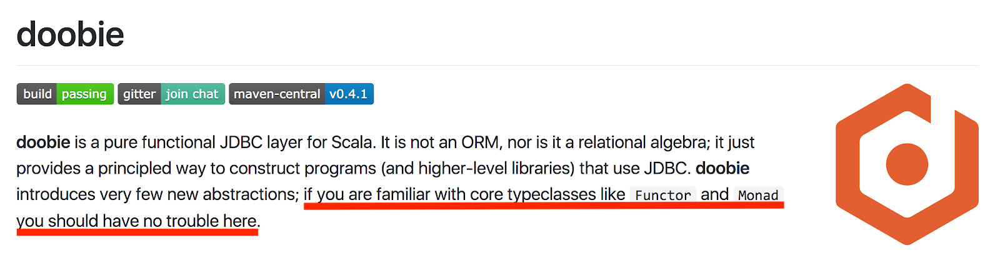

# Functional DB Access with Doobie

by Albert Pastrana @ [Intent HQ](https://www.intenthq.com)
---
# Ready to raise your hands
---
## You've never heard of Scala

---
## You've seen some Scala code

---
## You’ve coded some Scala

---
## You have Scala code in production

---
# What is doobie?
---

---

---
### A monad is just a monoid in the category of endofunctors, what's the problem?

http://james-iry.blogspot.com.es/2009/05/brief-incomplete-and-mostly-wrong.html <!-- .element: class="small" -->
---
### Doobie is a pure functional JDBC layer for Scala
### It is not an ORM, nor it is a relational algebra
---
## What this workshop is about?
---
Introduction, concepts  
Basic queries (select, insert, update)  
`NULL` handling  
Case classes (one, list)  
`INNER JOIN`  
Transactions  
---
## What this workshop is
# NOT
## about
---
Best practices around testing, DB design, functional programming, dependency injection...  
Advanced doobie (Process, Stream, `LEFT OUTER JOIN`)
---
### What (ideally) you should already know
`Option`, `Try`, `Either`, `List`  
`map`, `flatMap`, for comprehension  
`SQL`
---
## Want to know more?
Book of Doobie  
https://tpolecat.github.io/doobie/docs/01-Introduction.html
---
## Let's try it

